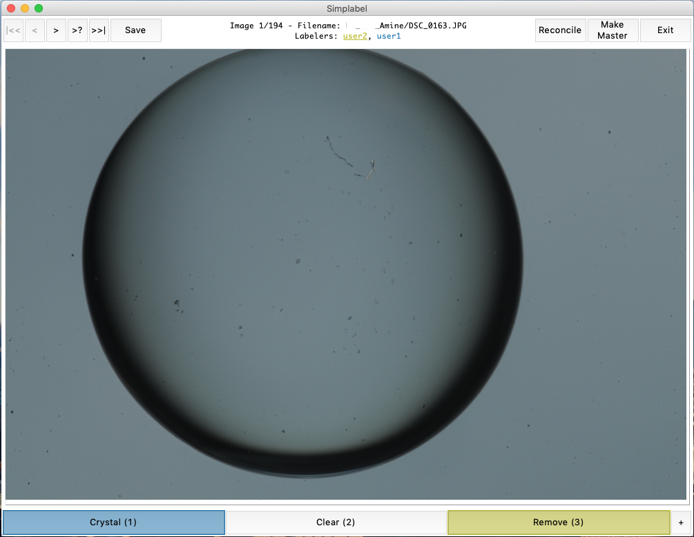

# Simplabel
[](https://pypi.org/project/simplabel/)
[](https://travis-ci.com/hlgirard/Simplabel/branches)
[](https://github.com/hlgirard/Simplabel/blob/master/LICENSE)

Graphical tool to manually label images in distinct categories to build training datasets.
Simply pass a list of categories, a directory containing images and start labelling.
Supports multiple users, reconciliation and keyboard bindings to label even faster!



## Installation

### Install with pip

Simplabel is on PyPI so it can be installed with pip

```
pip install simplabel
```

### Install from source

Clone the repository to your computer

```
git clone https://github.com/hlgirard/Simplabel.git
```

and install with pip 

```
cd Simplabel
pip install .
```

## Usage

### Quick start

Simplabel can be started from the command line without any argument:
```
simplabel
```
You will be prompted to select a directory containing images to label. Add labels with the '+' button and start labeling. Number keys correspond to labels and can be used instead.

The target directory and/or labels can also be passed directly from the command line:
```
simplabel --labels dog cat bird --directory path/to/image/directory
```

After the first use, labels are stored in `labels.pkl` and the `--labels` argument is ignored.

### Command line arguments

- `-d, --directory <PATH/TO/DIRECTORY>` sets the directory to search for images and save labels to. Defaults to the current working directory.
- `-l, --labels <label1 label2 label3 ...>` sets the categories for the labelling task. Only passed on the first use in a given directory.
- `-u, --user <USERNAME>` sets the username. Defaults to the OS login name if none is passed.
- `-r, --redundant` does not display other labelers selections for independent labelling. Reconciliation and Make Master are unavailable in this mode.
- `-v, --verbose` increases the verbosity level.
- `--remove-label <LABEL>` tries to safely remove a label from the list saved in `labels.pkl` (must also pass `-d`)
- `--reset-lock` overrides the lock preventing the same username from being used multiple times simultaneously.
- `--delete-all` removes all files created by simplabel in the directory (must also pass `-d`)

### Multiuser

The app relies on the filesystem to save each user's selection and display other user's selections. It works best if the working directory is on a shared drive or in a synced folder (Dropbox, Onedrive...). The Reconcile workflow allows any user to see and resolve conflicts. The Make Master option can be used to create and save a master dictionary - `labeled_master.pkl` - containing all labeled images (after reconciliation).

### Import saved labels

The app saves a `labeled_<username>.pkl` file that contains a pickeled dictionary {image_name: label}. To import the dictionary, use the following sample code:

```python
import pickle

with open("labeled_user1.pkl","rb") as f:
    label_dict = pickle.load(f)
```

## Advanced usage

### Utilities

Once you are done labelling, use the flow_to_directory tool to copy images to distinct directories by label

```
flow_to_directory --input-directory data/labeled --output-directory data/sorted
```

### Python object

The Tkinter app can also be started from a python environment

```python
from simplabel import ImageClassifier
import tkinter as tk

root = tk.Tk() 
directory = "data/raw"
categories = ['dog', 'cat', 'bird']
MyApp = ImageClassifier(root, directory, categories)
tk.mainloop()
```

## License

This project is licensed under the GPLv3 License - see the [LICENSE.md](LICENSE.md) file for details.

## Acknowledgements

Testing of tkinter GUI is based on ivan_pozdeev's answer at Stackoverflow:

https://stackoverflow.com/questions/4083796/how-do-i-run-unittest-on-a-tkinter-app
